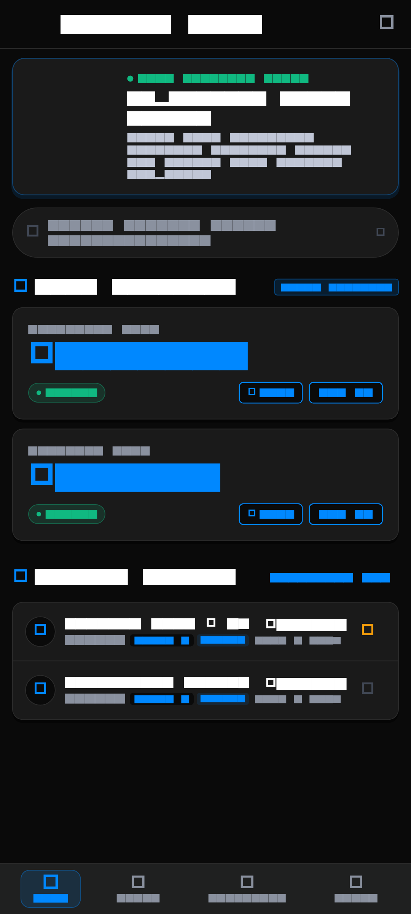
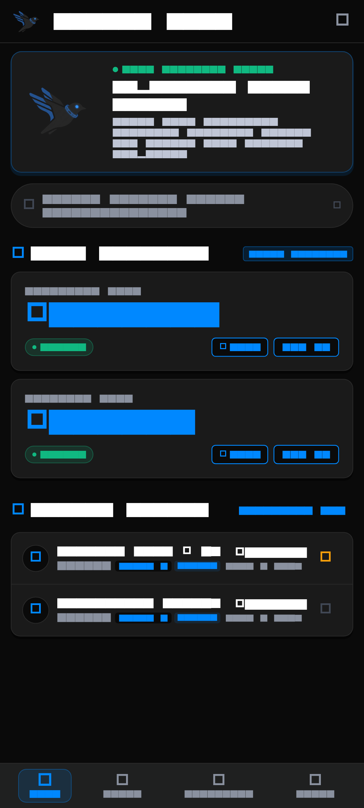
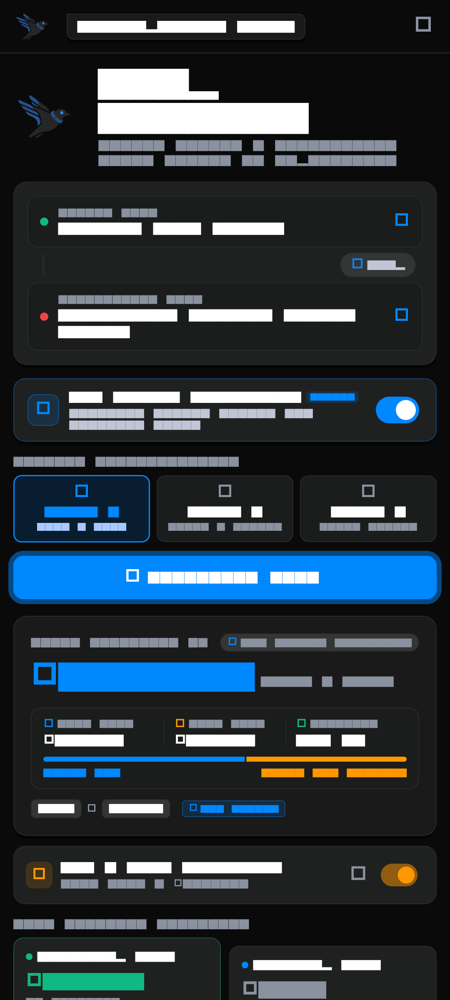
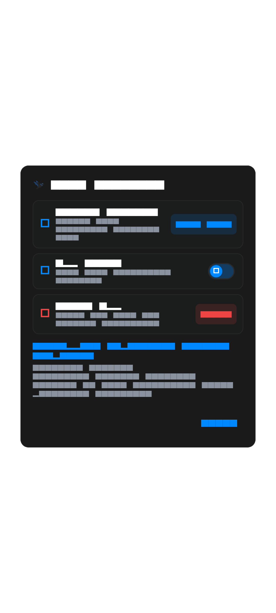

# Aero
> **A Philippine Expressway Driving Companion**

Aero helps drivers estimate Philippine expressway tolls, view Autosweep and Easytrip totals, plan trips, save recent routes, and estimate fuel cost. Built specifically to eliminate the confusion of multi-operator RFID tolling systems in Luzon and beyond.

---

## 📱 Screenshots

| Home Dashboard | Toll Calculator (Dark) | Recent Routes |
|:---:|:---:|:---:|
|  |  |  |

| Light Mode | Dark Mode | Driver & Theme Settings |
|:---:|:---:|:---:|
|  |  |  |

---

## ✨ Features

- **TRB-Matrix-Based Toll Estimates**: Accurate toll calculations for STAR, SLEX, Skyway Stages 1–3, NLEX, SCTEX, CALAX, CAVITEX, MCX, NAIAX, TPLEX, and CCLEX.
- **Class 1, 2, and 3 Vehicle Selection**: Dedicated vehicle classification selector with intuitive icons (🚗 Class 1 Cars/SUVs, 🚌 Class 2 Buses, 🚛 Class 3 Heavy Trucks).
- **Autosweep & Easytrip Breakdown**: Clear multi-operator split showing exactly how much balance is needed for SMC Tollways (Autosweep) vs. MPTC/Metro Pacific Tollways (Easytrip).
- **Skyway vs. At-Grade Routing**: Interactive toggle to switch between elevated Skyway and surface SLEX routes where supported.
- **Fuel-Cost Estimator**: Estimate total trip expenses with customizable pump prices, km/L fuel efficiency, and one-tap vehicle presets (Sedan, SUV, Van/Pickup).
- **Recent Routes & Favorites**: Automatically logs computed trips with one-tap favorite toggling and instant route re-calculation.
- **Saved Trip & Fuel Settings**: Remembers your preferred vehicle class, fuel efficiency, gas price, and recent route selections locally on your device.
- **Light, Dark, and System Themes**: Seamless theme switching with high-contrast Light Mode and sleek Nocturnal Dark Mode.
- **Pre-Trip Checklist**: Categorized vehicle roadworthiness, document, and RFID readiness checklist with persistent autosave across app restarts.
- **Emergency Hotlines**: Direct tap-to-call verified emergency numbers for TRB, SMC Tollways, MPTC, MMDA, and PNP Highway Patrol Group.
- **Offline Toll-Rate Fallback**: Fully functional offline without an internet connection using local cached rate matrices.
- **Manually Editable Toll-Rate Data**: Cleanly structured single-source toll data for easy maintenance when toll regulatory updates occur.

---

## ⚠️ Toll Estimate Disclaimer

> **Important:** Aero provides toll estimates based on manually maintained Toll Regulatory Board (TRB) rate matrices. Actual toll fees may vary due to newly gazetted rate adjustments, barrier configurations, or operator promos. Always check official TRB advisories and toll-plaza signage before travelling.

---

## 🛠️ Updating Toll Rates

All toll fare data in Aero is stored and maintained in a single structured file:
👉 [`lib/data/toll_rates_data.dart`](lib/data/toll_rates_data.dart)

### Code Structure Example

```dart
// Example rule from lib/data/toll_rates_data.dart
TollChargeRule(
  id: 'rule_star_tanauan_sto_tomas',
  expressway: 'STAR',
  operator: 'autosweep',
  collectionType: 'closedSystem',
  entryPlazaId: 'star_tanauan',
  exitPlazaId: 'star_sto_tomas',
  fareClass1: 14.0,
  fareClass2: 29.0,
  fareClass3: 43.0,
  effectiveFrom: DateTime(2024, 5, 1),
  sourceName: 'TRB Approved Toll Rate Matrix for STAR Tollway (May 2024)',
  sourceUrl: 'https://trb.gov.ph/index.php/toll-rates/star-tollway-toll-rate',
  ratesLastUpdated: DateTime(2026, 8, 19),
  notes: 'STAR Closed System OD: Tanauan to Sto. Tomas',
),
```

### Steps to Update Rates:
1. Open [`lib/data/toll_rates_data.dart`](lib/data/toll_rates_data.dart).
2. Locate the specific expressway and entry/exit segment.
3. Update `fareClass1`, `fareClass2`, and `fareClass3`.
4. Update `ratesLastUpdated` (and `effectiveFrom`) to reflect the latest TRB implementation date.
5. Run the test suite to verify route calculation correctness:
   ```bash
   flutter test
   ```

---

## 📦 Android APK Testing

To build the release APK for distribution and testing on physical Android devices:

```bash
flutter build apk --release
```

**Output APK location:**
```
build/app/outputs/flutter-apk/app-release.apk
```

### Installation Instructions for Testers:
1. Public testers must receive only **`app-release.apk`**, never `app-debug.apk` (which contains debugging overhead and unoptimized assets).
2. Transfer `app-release.apk` to your Android device.
3. Open the APK file on your device and follow the prompts to install (enable *"Install from unknown sources"* if prompted).
4. **Security Warning:** Always download the APK only from the official Aero GitHub repository releases or trusted team distribution links.

### Release Signing Setup (For Developers)

Release builds strictly require a private Android release keystore. Falling back to debug signing for release builds is disabled for security compliance.

1. **Generate a private release keystore** (if you don't have one):
   ```bash
   keytool -genkey -v -keystore android/app/release.keystore -keyalg RSA -keysize 2048 -validity 10000 -alias upload
   ```
2. **Create `android/key.properties`** with your private credentials:
   ```properties
   storePassword=<your-keystore-password>
   keyPassword=<your-key-password>
   keyAlias=upload
   storeFile=release.keystore
   ```
3. **Keep Keystores Private**: `android/key.properties` and `*.keystore` / `*.jks` are gitignored. **NEVER** commit keystores or signing passwords to source control or share them publicly.

---

## 🔒 Security & Data Privacy

- **Read-Only Public Data**: All expressway toll matrices, plaza definitions, emergency contacts, and guide content are strictly read-only for client SDKs. Client-side modifications, updates, and deletes are denied via Firestore Security Rules.
- **Write-Only Community Reports**: The `dataReports` collection permits client creation only so users can report outdated fares or numbers, while preventing client reads or tampering.
- **Zero Account Footprint**: Aero does not collect personally identifiable information (PII). Driver names and RFID wallet balances are stored strictly locally on the user's device via `SharedPreferences`.
- **Credential Protection**: Release signing keystores, `key.properties`, `.env` files, and Firebase service account credentials are gitignored and must never be committed to source control or distributed to testers.

---

## 📁 Project Structure

```
Toll/
├── assets/
│   ├── images/              # Mascot artwork, app icons, and logos
│   └── screenshots/         # Real screenshots for documentation
├── lib/
│   ├── data/                # Manually maintained toll rate matrices & plazas
│   │   ├── toll_plazas_data.dart
│   │   ├── toll_rates_data.dart
│   │   └── toll_segments_data.dart
│   ├── models/              # Data models (TollPlaza, Route, RecentTrip, etc.)
│   ├── screens/             # UI Screens (Home, TollCalculator, Guide, Checklist, etc.)
│   ├── services/            # CacheService, TollService, RoutingEngine
│   ├── theme.dart           # Light & Dark theme definitions and tokens
│   └── main.dart            # Application entrypoint
├── test/                    # Comprehensive unit and widget test suites
├── firestore.rules          # Firestore Security Rules definition
└── pubspec.yaml             # Flutter project dependencies & assets
```

---

## 🤝 Contributing

Contributions to update toll rates, add new expressway plazas, or improve route calculations are welcome!
1. Fork the repository.
2. Create a feature branch: `git checkout -b update/nlex-rates`.
3. Make your edits in `lib/data/toll_rates_data.dart` with official TRB source links.
4. Verify with `flutter test` and `flutter analyze`.
5. Submit a Pull Request.

---

## 📄 License

License: To be added