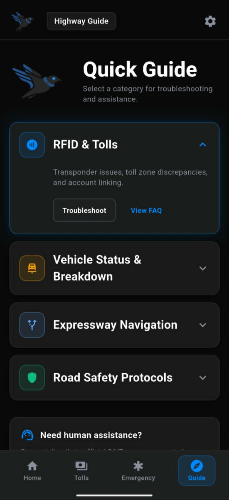
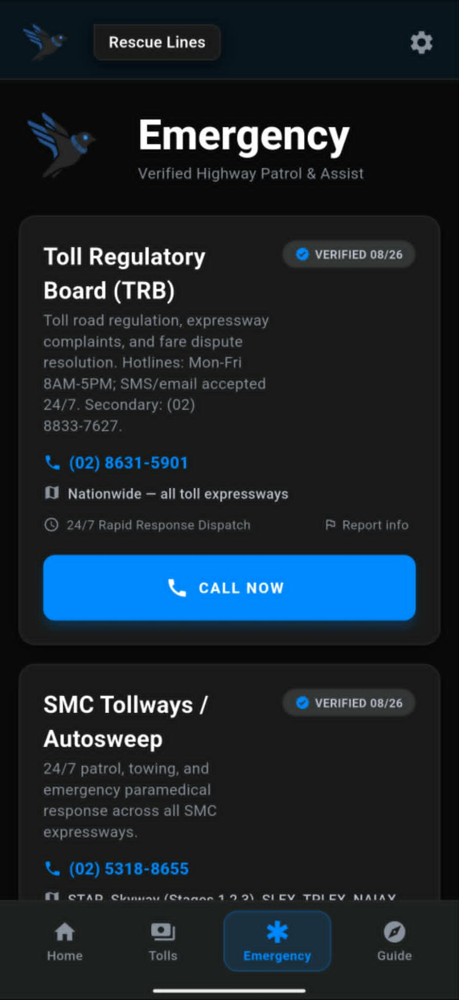
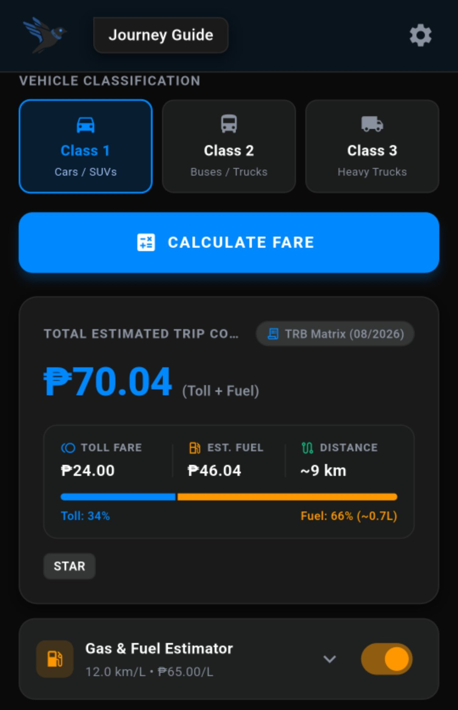
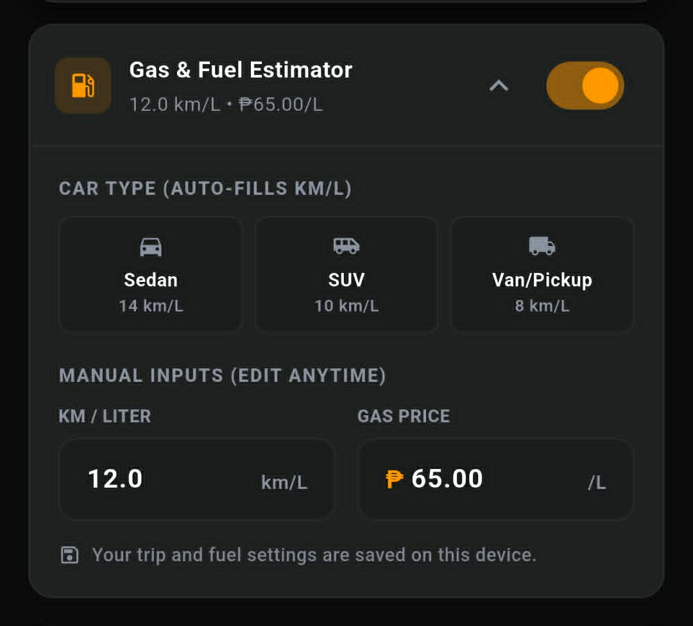
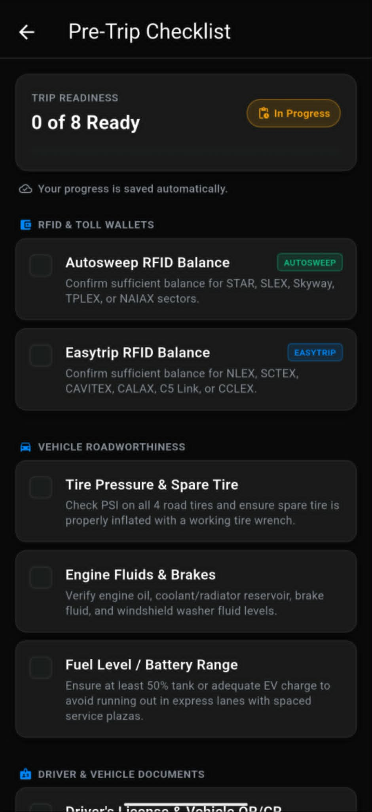

<div align="center">

  

  # Aero
  ### A Philippine Expressway Driving Companion

  Plan Philippine expressway trips, estimate tolls, track RFID costs, and prepare for the road.

  <p align="center">
    <code>🛣️ Toll Estimates</code> &nbsp;
    <code>💳 RFID Breakdown</code> &nbsp;
    <code>⛽ Fuel Planning</code> &nbsp;
    <code>🆘 Road Assistance</code>
  </p>

</div>

---

## 📱 See Aero in Action

<div align="center">
  
  &nbsp;
  
  <br /><br />
  
  &nbsp;
  
</div>

<br />

<details>
<summary><b>📷 More Features (Vehicle Classes, Fuel Estimator, Checklist, & Settings)</b></summary>
<br />
<div align="center">
  
  &nbsp;
  
  <br /><br />
  
  &nbsp;
  
  <br /><br />
  
  &nbsp;
  
</div>
</details>

---

## ✨ Features

| Feature | Description |
|---|---|
| 🛣️ **Toll Calculator** | Estimate expressway tolls from selected origin and destination across 11+ Philippine expressways. |
| 🚗 **Vehicle Classes** | Class 1, 2, and 3 options with clear vehicle icons. |
| 💳 **RFID Breakdown** | View Autosweep and Easytrip subtotals. |
| ⛽ **Fuel Estimator** | Estimate fuel cost for your trip. |
| 🕘 **Recent Routes** | Reopen previously calculated trips quickly. |
| ✅ **Trip Checklist** | Prepare before leaving; progress is saved locally. |
| 🆘 **Emergency Assistance** | Quick access to helpful road/emergency contacts. |
| 📖 **Quick Guide** | Basic expressway and RFID guidance. |
| 🌗 **Appearance Modes** | Light, Dark, and System themes. |
| 📶 **Offline Ready** | Use locally stored toll-rate data when offline. |

---

## ⚠️ Toll Estimate Notice

> **Toll estimate notice:** Aero provides toll estimates based on manually maintained TRB rate matrices. Actual toll fees may vary. Always check official advisories and toll-plaza signage before travelling.

*Aero is an independent open-source utility and is not officially affiliated with, endorsed by, or verified by the Toll Regulatory Board (TRB), San Miguel Corporation (SMC), Metro Pacific Tollways Corporation (MPTC), Autosweep RFID, or Easytrip RFID.*

---

## 🛠️ Tech Stack

- **Framework**: [Flutter](https://flutter.dev/) (v3.19+)
- **Language**: [Dart](https://dart.dev/)
- **Backend / Database**: [Cloud Firestore](https://firebase.google.com/docs/firestore) (Public reference catalog & report submissions)
- **Local Persistence**: `SharedPreferences` (Driver profile, wallet balances, trip history, and checklist state)
- **Platform Features**: `url_launcher` (Direct phone dialer integration for hotline calls)

---

## 🚀 Getting Started

### Prerequisites
- [Flutter SDK](https://docs.flutter.dev/get-started/install) installed and added to your `PATH`
- Android Studio or VS Code with Flutter extension
- Connected Android device or emulator

### Installation & Commands

```bash
# 1. Clone the repository
git clone https://github.com/DreiwanabeTexh/toll-companion.git
cd toll-companion

# 2. Fetch dependencies
flutter pub get

# 3. Launch application
flutter run

# 4. Run test suite
flutter test

# 5. Run static analysis
flutter analyze
```

### Build Android Release APK

```bash
flutter build apk --release
```
*Output location:* `build/app/outputs/flutter-apk/app-release.apk`

---

## 🛠️ Updating Toll Rates

Expressway fare rules are centralized in a single structured data file:
👉 [`lib/data/toll_rates_data.dart`](lib/data/toll_rates_data.dart)

### Real Code Example

```dart
// Rule definition in lib/data/toll_rates_data.dart
TollChargeRule(
  id: 'rule_star_tanauan_sto_tomas',
  expressway: 'STAR',
  operator: 'autosweep',
  collectionType: 'closedSystem',
  entryPlazaId: 'star_tanauan',
  exitPlazaId: 'star_sto_tomas',
  fareClass1: 14.0,
  fareClass2: 29.0,
  fareClass3: 43.0,
  effectiveFrom: DateTime(2024, 5, 1),
  sourceName: 'TRB Approved Toll Rate Matrix for STAR Tollway (May 2024)',
  sourceUrl: 'https://trb.gov.ph/index.php/toll-rates/star-tollway-toll-rate',
  ratesLastUpdated: DateTime(2026, 8, 19),
  notes: 'STAR Closed System OD: Tanauan to Sto. Tomas',
),
```

### Update Procedure:
1. Open [`lib/data/toll_rates_data.dart`](lib/data/toll_rates_data.dart).
2. Update `fareClass1`, `fareClass2`, and `fareClass3` values.
3. Update `ratesLastUpdated` and `effectiveFrom` timestamps.
4. Verify changes: `flutter test` and `flutter analyze`.

---

## 📁 Project Structure

```
Toll/
├── assets/
│   ├── images/              # Logos, mascots, and app branding assets
│   └── screenshots/         # Real application screenshots in PNG format
├── lib/
│   ├── data/                # Toll rate matrices & expressway network definitions
│   ├── models/              # Data models (TollPlaza, Route, RecentTrip, etc.)
│   ├── screens/             # UI Screens (Home, TollCalculator, Guide, Checklist, etc.)
│   ├── services/            # CacheService, RoutingEngine, FirestoreService
│   ├── theme.dart           # Light & Dark theme definitions
│   └── main.dart            # Application entrypoint
├── test/                    # Comprehensive unit and widget test suites
├── firestore.rules          # Firestore Security Rules definition
└── pubspec.yaml             # Dependencies & asset declarations
```

---

## 🤝 Contributing

1. Fork the repository.
2. Create a feature branch: `git checkout -b update/toll-rates`.
3. Apply edits in [`lib/data/toll_rates_data.dart`](lib/data/toll_rates_data.dart).
4. Run `flutter test` and `flutter analyze` to confirm clean build.
5. Submit a Pull Request.

---

<div align="center">

  **License:** To be added &nbsp;•&nbsp; Built with **Flutter** 💙 &nbsp;•&nbsp; *Made for Philippine drivers* 🇵🇭

</div>